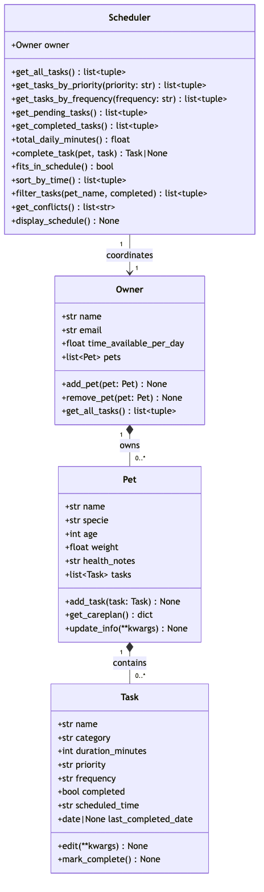

# PawPal+ — Pet Care Scheduler

A Streamlit app that helps busy pet owners build, sort, and manage daily care plans for one or more pets — with automatic conflict detection, recurrence, and capacity warnings.

---

## 📸 Demo

<a href="/course_images/ai110/pawpal_screenshot.png" target="_blank">
  
</a>

> **To add your screenshot:** run the app with `streamlit run app.py`, take a screenshot, save it as `pawpal_screenshot.png` in your project folder, and update the paths above.

---

## Features

### Core task management
- **Add pets and tasks** — register multiple pets and assign care tasks with name, category, duration, priority, frequency, and scheduled time
- **Edit and complete tasks** — update any field with `Task.edit()`, mark tasks done with one click in the UI
- **Care plan export** — `Pet.get_careplan()` returns a full dictionary summary of a pet's profile and all its tasks

### Smart scheduling algorithms

| Feature | Method | How it works |
|---|---|---|
| **Chronological sorting** | `Scheduler.sort_by_time()` | Converts each `"HH:MM"` string to an integer (e.g. `"08:30"` → `830`) and sorts ascending — no `datetime` import needed |
| **Conflict detection** | `Scheduler.get_conflicts()` | Models each pending task as an interval `[start, start + duration)` in minutes-since-midnight and tests every unique pair with the overlap condition `start_a < end_b AND start_b < end_a`. Same-pet overlaps → **HARD** conflict; cross-pet → **SOFT** conflict |
| **Auto-recurrence** | `Scheduler.complete_task()` | Marks the original task done and clones a fresh pending copy for `daily` and `weekly` frequencies using `dataclasses.replace`; non-recurring frequencies (`monthly`, `as needed`) get no follow-up |
| **Capacity check** | `Scheduler.fits_in_schedule()` | Sums `duration_minutes` across all daily-frequency tasks and compares against `owner.time_available_per_day × 60` |
| **Flexible filtering** | `Scheduler.filter_tasks()` | Chains optional filters by pet name and/or completion status without fetching unneeded data |

### UI highlights (app.py)
- Conflict warnings surface as **red error banners** (HARD) or **yellow warning banners** (SOFT) with plain-English explanations
- Pending tasks listed in chronological order with priority color dots (🔴🟡🟢)
- Completed tasks collapse into an expander to keep the main view clean
- Capacity bar shows minutes used vs. available in real time

---

## System architecture

The UML class diagram below reflects the final implementation:

<a href="uml_final.png" target="_blank">
  
</a>

**Relationships:**
- `Owner` ◆── `Pet` ◆── `Task` — composition: child objects are owned by their parent
- `Scheduler` ──▶ `Owner` — directed association: the scheduler coordinates the owner's data without owning it

---

## Getting started

### Setup

```bash
python -m venv .venv
source .venv/bin/activate   # Windows: .venv\Scripts\activate
pip install -r requirements.txt
```

### Run the app

```bash
streamlit run app.py
```

---

## Testing

### Run the test suite

```bash
python -m pytest test/test_pawpal.py -v
```

### What the tests cover

The suite contains **17 tests** across three core areas:

| Area | Tests | What is verified |
|---|---|---|
| **Sorting correctness** | 4 | `sort_by_time()` returns tasks chronologically regardless of insertion order, handles multiple pets, and returns an empty list for an empty schedule |
| **Recurrence logic** | 5 | Completing a `daily` or `weekly` task adds a fresh pending copy; completing `monthly` does not; the original is always marked done; pets with no tasks yield empty pending lists |
| **Conflict detection** | 6 | Overlapping same-pet tasks → `HARD CONFLICT`; overlapping cross-pet tasks → `SOFT CONFLICT`; completed tasks excluded; non-overlapping and empty schedules return no warnings |

Both happy-path and edge cases (empty pet, exact same start time, non-recurring frequencies) are covered.

### Confidence level

★★★★☆ (4 / 5)

All 17 tests pass. Core scheduling behaviors are well-verified. One star withheld: tests are in-memory only (no UI or persistence layer tested), and `complete_task` clones a task without advancing `scheduled_time` to the next day — a known limitation worth addressing in a future iteration.

---

## Project workflow

1. Draft requirements and identify edge cases
2. Design UML class diagram (`uml_final.mmd` / `uml_final.png`)
3. Implement class stubs from UML
4. Build scheduling logic in `pawpal_system.py`
5. Write and pass automated tests in `test/test_pawpal.py`
6. Connect logic to Streamlit UI in `app.py`
7. Refine UML to match final implementation
