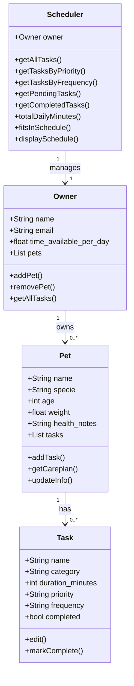

# PawPal+ Project Reflection

## 1. System Design

- a user should be able to schedule tasks based on a timeline
- a user should be able to add new tasks
- a user should be able to edit the tasks.
**a. Initial design**

 - For a pet care app like PawPal, objects might be:
    - Task:
        - Attributes: name, category, duration_minutes, priority, frequency, completed
        - Methods: edit(), markComplete()
    - Pet:
        - Attributes: name, specie, age, weight, health_notes, tasks
        - Methods: addTask(), getCareplan(), updateInfo()
    - Owner:
        - Attributes: name, email, time_available_per_day, pets
        - Methods: addPet(), removePet(), getAllTasks()
    - Scheduler:
        - Attributes: owner
        - Methods: getAllTasks(), getTasksByPriority(), getTasksByFrequency(), getPendingTasks(), getCompletedTasks(), totalDailyMinutes(), fitsInSchedule(), displaySchedule()

**b. Design changes**

Yes. The biggest change was adding `scheduled_time` to `Task` and three new methods to `Scheduler` — `sort_by_time()`, `get_conflicts()`, and `complete_task()`. None of these were in the Phase 1 UML. Once I started building the UI, it became clear that a flat task list with no time ordering or conflict awareness wasn't useful to a real user, so I extended the design to support those behaviors.

---

## 2. Scheduling Logic and Tradeoffs

**a. Constraints and priorities**

The scheduler considers three constraints: time (total daily task minutes vs. the owner's available hours), scheduling conflicts (overlapping time windows between tasks), and priority (high/medium/low labels that inform the UI display order). I decided time and conflicts mattered most because they represent hard limits — an over-scheduled day or a physically impossible overlap can't be worked around, while priority is softer guidance the owner can choose to ignore.

**b. Tradeoffs**

The scheduler detects conflicts using interval overlap rather than checking only exact start-time matches. This means a task starting at 08:00 for 30 minutes will correctly flag a conflict with a task starting at 08:15, even though their start times differ.

The tradeoff is that `scheduled_time` is stored as a plain `"HH:MM"` string with no date component, so the scheduler has no awareness of which day a task falls on. A "weekly" task and a "daily" task that share the same time slot will always appear as a conflict even if the weekly task only runs on Sundays. For a single-owner pet care app operating within one day's view, this is a reasonable simplification — it errs on the side of over-warning rather than missing a real overlap, and keeps the conflict logic dependency-free (no calendar library required).

---

## 3. AI Collaboration

**a. How you used AI**

I used AI for design brainstorming, generating test cases, and polishing the UI. The most helpful prompts were specific and structural — for example, asking "what edge cases should I test for a pet scheduler with sorting and recurring tasks?" returned targeted suggestions I could act on immediately, whereas vague prompts like "help me with my app" produced generic answers I had to filter heavily.

**b. Judgment and verification**

When I asked AI to generate the test suite, it initially suggested mocking `date.today()` in the recurrence tests. I didn't accept that — mocking a built-in adds complexity and can hide real bugs. Instead I verified the recurrence behavior by checking the clone's `completed` and `last_completed_date` fields directly, which is simpler and tests the actual logic without faking the environment.

---

## 4. Testing and Verification

**a. What you tested**

I tested three core behaviors: sorting correctness (tasks returned in chronological order), recurrence logic (completing a daily/weekly task auto-creates the next occurrence), and conflict detection (overlapping time windows flagged as HARD or SOFT). These were the most important because they are the core value of the scheduler — if any of them break, the daily plan is wrong.

**b. Confidence**

★★★★☆ — all 17 tests pass. I'm confident in the scheduling logic itself. If I had more time, I'd test that `complete_task` correctly handles a pet whose task list is modified mid-iteration, and that `filter_tasks` works correctly when both filters are applied together on a mixed completed/pending list.

---

## 5. Reflection

**a. What went well**

- What part of this project are you most satisfied with?

The scheduling logic is the part I'm most satisfied with. The conflict detection, priority sorting, and recurrence system all work together cleanly, and managing multiple pets simultaneously without data bleeding between them turned out to be simpler than I expected once the class structure was right. Seeing all 17 tests pass on the final version was a good signal that the core logic held up.

**b. What you would improve**

- If you had another iteration, what would you improve or redesign?

I would redesign the UI. The current layout is functional but not intuitive — it takes more clicks than it should to do basic things like adding a task or viewing a specific pet's schedule. I'd also store tasks with a full date rather than just a time string, which would make the conflict detection more accurate for weekly and monthly recurring tasks instead of flagging false conflicts.

**c. Key takeaway**

- What is one important thing you learned about designing systems or working with AI on this project?

I learned that starting with a clear UML is the most important step — it forces you to make real design decisions before touching any code, and surfaces missing features early when they're cheap to add. I also learned to be specific when prompting AI: a focused question about edge cases or a concrete design problem gives immediately usable answers, while a vague prompt just produces generic output that requires heavy filtering.