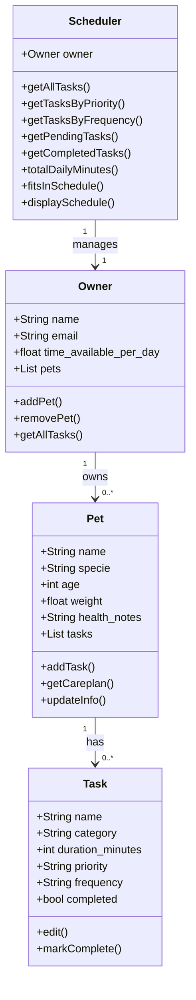

# PawPal+ Project Reflection

## 1. System Design

- a user should be able to schedule tasks based on a timeline
- a user should be able to add new tasks
- a user should be able to edit the tasks.
**a. Initial design**

- Briefly describe your initial UML design.
- What classes did you include, and what responsibilities did you assign to each?
 - For a pet care app like PawPal, objects might be:
    - Task:
        - Attributes: name, category, duration_minutes, priority, frequency, completed
        - Methods: edit(), markComplete()
    - Pet:
        - Attributes: name, specie, age, weight, health_notes, tasks
        - Methods: addTask(), getCareplan(), updateInfo()
    - Owner:
        - Attributes: name, email, time_available_per_day, pets
        - Methods: addPet(), removePet(), getAllTasks()
    - Scheduler:
        - Attributes: owner
        - Methods: getAllTasks(), getTasksByPriority(), getTasksByFrequency(), getPendingTasks(), getCompletedTasks(), totalDailyMinutes(), fitsInSchedule(), displaySchedule()

**b. Design changes**

- Did your design change during implementation?
- If yes, describe at least one change and why you made it.

---

## 2. Scheduling Logic and Tradeoffs

**a. Constraints and priorities**

- What constraints does your scheduler consider (for example: time, priority, preferences)?
- How did you decide which constraints mattered most?

**b. Tradeoffs**

The scheduler detects conflicts using interval overlap (`start_a < end_b AND start_b < end_a`) rather than checking only exact start-time matches. This means a task starting at 08:00 for 30 minutes will correctly flag a conflict with a task starting at 08:15, even though their start times differ.

The tradeoff is that `scheduled_time` is stored as a plain `"HH:MM"` string with no date component, so the scheduler has no awareness of which day a task falls on. A "weekly" task and a "daily" task that share the same time slot will always appear as a conflict even if the weekly task only runs on Sundays. For a single-owner pet care app operating within one day's view, this is a reasonable simplification — it errs on the side of over-warning rather than missing a real overlap, and keeps the conflict logic dependency-free (no calendar library required).

---

## 3. AI Collaboration

**a. How you used AI**

- How did you use AI tools during this project (for example: design brainstorming, debugging, refactoring)?
- What kinds of prompts or questions were most helpful?

**b. Judgment and verification**

- Describe one moment where you did not accept an AI suggestion as-is.
- How did you evaluate or verify what the AI suggested?

---

## 4. Testing and Verification

**a. What you tested**

- What behaviors did you test?
- Why were these tests important?

**b. Confidence**

- How confident are you that your scheduler works correctly?
- What edge cases would you test next if you had more time?

---

## 5. Reflection

**a. What went well**

- What part of this project are you most satisfied with?

**b. What you would improve**

- If you had another iteration, what would you improve or redesign?

**c. Key takeaway**

- What is one important thing you learned about designing systems or working with AI on this project?
